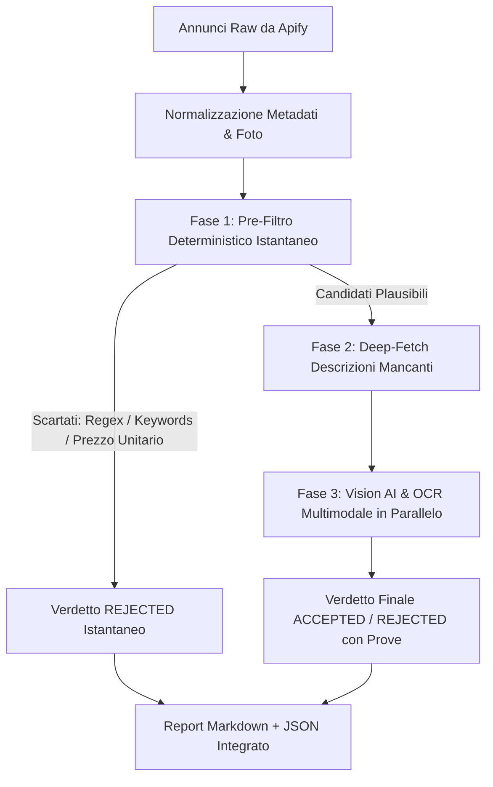

# 👁️ Motore AI Vision Inspector

Il motore **AI Vision Inspector** (in `packages/shared-mcp-utils/src/ai-inspector.ts`) gestisce la validazione autonoma ad altissima precisione dei componenti hardware tramite una pipeline a 3 fasi.

---

## ⚡ Pipeline di Ispezione a 3 Fasi



---

## 🔍 Descrizione Dettagliata delle Fasi

### Fase 1: Pre-Filtro Deterministico Istantaneo (Zero Latenza AI)
Prima di consumare token AI o chiamate multimodali, ogni annuncio viene processato attraverso i `deterministic_filters` definiti nel modulo JSON della regola:
1. **Exclude Keywords**: Scarta inserzioni contenenti termini non pertinenti (es. per i case: *"custodia", "borsa", "case logic", "sleeve", "ventola 120mm", "filtro"*).
2. **Require Keywords**: Per i moduli specifici (es. `case_open_itx`), richiede la presenza di termini identificativi obbligatori (*"open", "frame", "bench", "banchetto", "xproto", "hydra"*).
3. **Filtro Prezzo/GB**: Per le RAM, calcola il rapporto €/GB ed esclude immediatamente offerte con prezzo unitario superiore alla soglia.

### Fase 2: Deep-Fetch Descrizioni Mancanti
Per i candidati plausibili che presentano descrizioni incomplete o assenti dal catalogo base (come spesso accade su Vinted dove il titolo catalogo è generico), il sistema effettua il download asincrono della scheda completa dell'annuncio con un pool a concorrenza controllata.

### Fase 3: Targeted Multimodal Vision AI & OCR
I candidati vengono raggruppati in batch e inviati al modello Multimodale/Vision (es. `qwen2.5vl`, `gpt-4o`, `gemini`):
- Il modello ispeziona direttamente le immagini caricate (etichette, connettori, pin, proporzioni del telaio).
- Esegue l'OCR del Part Number (P/N) del produttore.
- Verifica il conteggio degli slot di espansione PCIe posteriori per confermare il form factor ATX (7+), mATX (4-5) o Mini-ITX (1-3).
- Genera un verdetto strutturato `ACCEPTED` o `REJECTED` con motivazione ed evidenza fotografica.

---

## ⚙️ Variabili di Configurazione AI

Nel file `.env` o nell'ambiente è possibile personalizzare l'engine AI:

```env
AI_VISION_ENABLED=true
AI_BASE_URL=http://localhost:11434/v1
AI_MODEL=qwen2.5vl
AI_API_KEY=ollama
MAX_AI_INSPECTIONS=20
```
