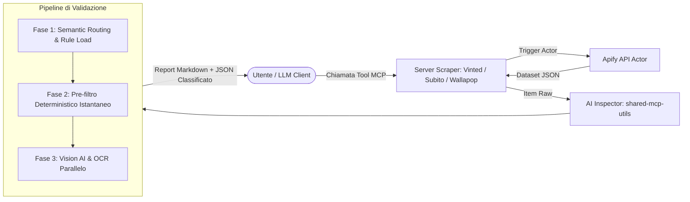

# 🏗️ Architettura del Monorepo

Il progetto **Oli II Hands Searcher MCP Server** è strutturato come un monorepo TypeScript basato su **NPM Workspaces**.

---

## 📁 Struttura delle Directory

```
oli-II-Hands-searcher-mcp-server/
├── package.json                 # Configurazione root e script globali dei workspaces
├── tsconfig.base.json           # Configurazione base TypeScript condivisa
├── mcp_config.json              # Configurazione client MCP aggregata
├── hardware_rules.json          # Database centrale di regole hardware sincrone
├── wiki/                        # Documentazione e Wiki del progetto
└── packages/                    # Pacchetti e server MCP
    ├── shared-mcp-utils/        # Utility condivise, AI Inspector e regole hardware JSON
    ├── subito-scraper/          # Server MCP per scraping Subito.it
    ├── vinted-scraper/          # Server MCP per scraping Vinted (Europa e USA)
    └── wallapop-scraper/        # Server MCP per scraping Wallapop (Spagna e Italia)
```

---

## 📦 Descrizione dei Pacchetti

### 1. `shared-mcp-utils`
Libreria interna condivisa contenente:
- **`ai-inspector.ts`**: Motore di ispezione a tre fasi (pre-filtro regex/deterministico, deep-fetch descrizioni, batch Vision AI con sharp e fetch multimodale).
- **`rules/*.json`**: Definizioni dichiarative dei moduli di regole hardware con filtri deterministici di inclusione/esclusione e direttive morfologiche visive.
- **`index.ts`**: Utility per il caricamento delle regole (con supporto a override da directory esterna `HARDWARE_RULES_DIR`), discovery automatica dei moduli (`listAvailableModules`), Semantic Router (`detectRuleModuleId`) e registrazione del prompt `hardware_expert_search`.

### 2. `vinted-scraper`
Server MCP autonomo che si interfaccia con l'Apify Actor `automation-lab/vinted-scraper`:
- Supporta domini regionali europei (`vinted.it`, `vinted.fr`, `vinted.de`, `vinted.es`, `vinted.nl`, `vinted.be`, `vinted.co.uk`, `vinted.com`).
- Filtri su prezzi, ordinamento, conteggio item e timeout.
- Normalizzazione degli slug per estrarre il modello del prodotto dai percorsi URL di Vinted.

### 3. `subito-scraper`
Server MCP per la piattaforma italiana Subito.it:
- Generatore avanzato di URL (`buildSubitoSearchUrl`) per categoria, regione geografica, filtri prezzo, ordinamento e opzione TuttoSubito con spedizione.
- Integrazione con l'Apify Actor dedicato a Subito.it.

### 4. `wallapop-scraper`
Server MCP per la piattaforma spagnola/italiana Wallapop:
- Generatore di URL di ricerca per coordinate e categorie.
- Scraping mirato di liste di annunci o ricerca per keyword.

---

## 🔄 Flusso dei Dati e Pipeline


