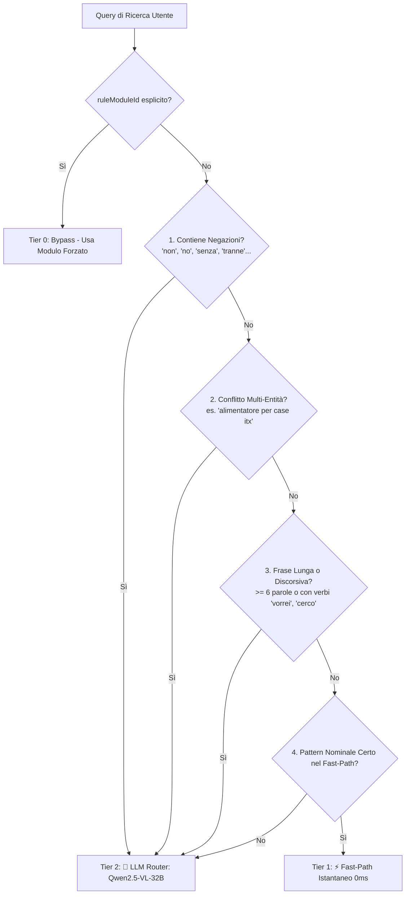

# 🧭 Semantic Routing & Prompting

Il sistema implementa un'**Architettura Ibrida a 2 Livelli (Hybrid 2-Tier Semantic Router)** che combina la velocità istantanea ($0\text{ ms}$) dei filtri deterministici per le ricerche dirette con la potenza dell'LLM (**Qwen2.5-VL-32B**) per disambiguare query complesse, discorsive o contenenti negazioni.

---

## 🏗️ Architettura Ibrida a 2 Livelli (Tier 1 vs Tier 2)



---

## ⚡ Tier 1: Fast-Path Deterministico (`detectRuleModuleId`)
Per l'80% delle ricerche di acquisto standard (nomi di modelli, sigle esatte, formati espliciti), il sistema risponde in memoria in $\approx 0\text{ ms}$ senza spendere token:

```typescript
"Corsair 4000D"              --> "case_atx"
"RAM DDR5 32GB 6000MHz"      --> "ram_ddr5"
"open frame itx"             --> "case_open_itx"
"asus prime ap201"           --> "case_matx"
"corsair sf750 platinum"     --> "psu_sfx"
```

---

## 🤖 Tier 2: LLM Semantic Router (`routeQueryWithLlm`)
Quando la query presenta complessità semantica, interviene **Qwen2.5-VL-32B** (o il modello configurato su Ollama/endpoint OpenAI-compatible).

L'LLM riceve la query e la lista dinamica dei moduli (`listAvailableModules()`), restituendo un oggetto JSON vincolato a tasso di allucinazione nullo:

```json
{
  "selectedModuleId": "psu_sfx",
  "confidence": 0.98,
  "reason": "L'utente intende acquistare un alimentatore, mentre il case ITX aperto rappresenta solo il contesto della build."
}
```

### Esempi Gestiti da Tier 2:
1. **Negazioni ed Esclusioni**:
   - `"case compatto ma non itx"` $\rightarrow$ **`case_matx`** (esclude ITX ed evita errori regex).
   - `"banchetto test senza pannelli chiusi"` $\rightarrow$ **`case_open`**.
2. **Ambiguità Multi-Componente**:
   - `"cerco un alimentatore per montare una build su telaio aperto itx"` $\rightarrow$ **`psu_sfx`** (capisce l'oggetto effettivo d'acquisto).
   - `"scheda madre b650m per case compatto"` $\rightarrow$ **`matx_motherboard`**.
3. **Linguaggio Naturale Discorsivo**:
   - `"vorrei montare un pc da banco per fare overclock spendendo poco"` $\rightarrow$ **`case_open`**.

---

## 🛠️ Tool MCP: `get_available_hardware_rules`

Tutti i server MCP esportano il tool `get_available_hardware_rules` per ispezionare dinamicamente il catalogo delle regole caricate:

```json
{
  "case_open_itx": "Case PC Open Frame Mini-ITX (Open Bench ITX / SFF) - ...",
  "case_open_matx": "Case PC Open Frame Micro-ATX (Open Bench mATX) - ...",
  "case_open_atx": "Case PC Open Frame ATX (Open Bench ATX / E-ATX) - ...",
  "case_open": "Case PC Aperto / Open Frame / Banchetto di Test - ...",
  "case_closed": "Case PC Chiuso (Standard Chassis / Torre / Cubo) - ...",
  "case_atx": "Case PC ATX (Mid-Tower / Full-Tower / Open Frame ATX) - ...",
  "case_matx": "Case PC Micro-ATX (mATX / Mini-Tower / Open Frame mATX) - ...",
  "case_itx": "Case PC Mini-ITX (SFF / Open Frame ITX) - ...",
  "case_pc": "Case PC (Generico) - ...",
  "matx_motherboard": "Scheda Madre Micro-ATX (mATX) - ...",
  "psu_sfx": "Alimentatore SFX / SFX-L - ...",
  "ram_ddr5": "RAM DDR5 Desktop (DIMM / UDIMM) - ...",
  "ram": "Memoria RAM (Generico) - ..."
}
```

---

## 🧠 Prompt Esperto MCP: `hardware_expert_search`

I client MCP possono invocare il prompt esperto per delegare una sessione di revisione visiva:

```json
{
  "name": "hardware_expert_search",
  "arguments": {
    "rule_module_id": "case_open_itx",
    "user_target_specs": "Banchetto Mini-ITX compatto in alluminio"
  }
}
```
